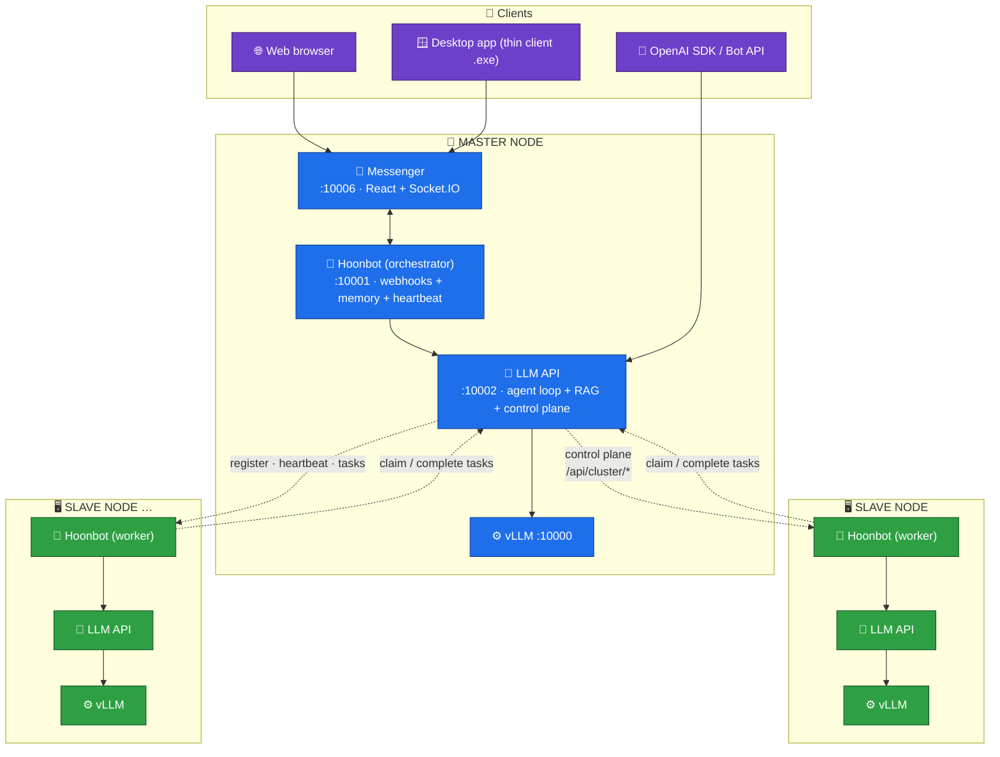
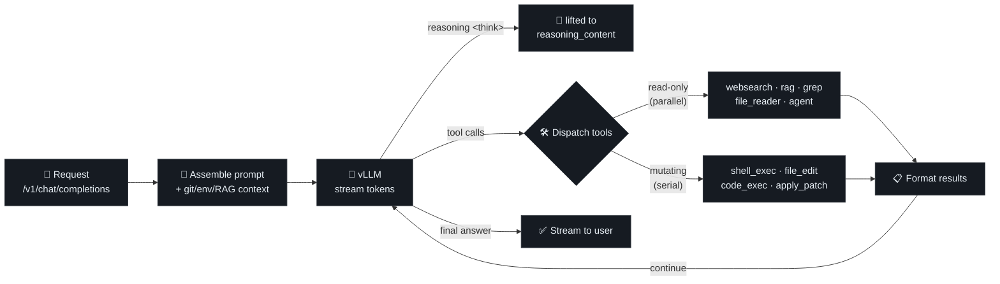
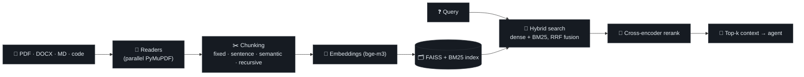
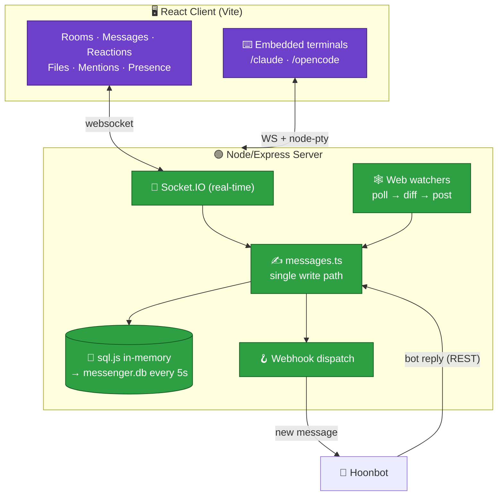
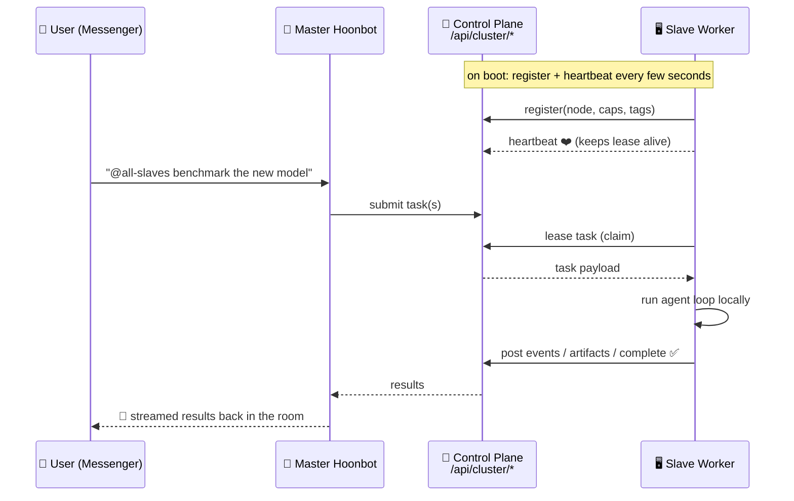

# 🧠 Huni — Self-Hosted, Multi-Node AI Platform

**One repository. One config file. A whole private AI cluster.**

Huni is a fully self-hosted, **air-gap-ready** AI platform that turns a fleet of
LAN machines into a single, coordinated agentic system — reachable through a
built-in **team Messenger** with a real chat UI, embedded coding terminals, and
a chat bot that can delegate work across every node in the cluster.

No cloud. No outbound internet required. No per-token billing. You run the
models, you own the data.

```
        ┌─────────────────────────────────────────────────────────────┐
        │                     👤  Users & Teams                        │
        │        Web browser  ·  Windows desktop app  ·  Bot API       │
        └───────────────────────────────┬─────────────────────────────┘
                                         │  (LAN / VPN)
        ┌────────────────────────────────▼────────────────────────────┐
        │                        🏰  MASTER NODE                       │
        │   Messenger UI  +  Orchestrator Bot  +  Agentic LLM API      │
        │              single pane of glass for everything             │
        └───────┬───────────────────┬───────────────────────┬─────────┘
                │                   │                        │
      ┌─────────▼──────┐  ┌─────────▼──────┐        ┌────────▼───────┐
      │  🖥  SLAVE 135  │  │  🖥  SLAVE 136  │  ...   │  🖥  SLAVE N    │
      │  LLM API + Bot  │  │  LLM API + Bot  │        │  LLM API + Bot │
      │  local vLLM GPU │  │  local vLLM GPU │        │  local vLLM GPU│
      └────────────────┘  └────────────────┘        └────────────────┘
```

---

## ✨ Why Huni

| | |
|---|---|
| 🏰 **Single master, many workers** | One master node hosts the UI, the bot, and the control plane. Add GPU machines as slaves and they auto-register — no reconfiguration of the master. |
| 💬 **Built-in Messenger** | A real-time team chat (rooms, files, reactions, mentions, presence) is the human interface to the whole cluster. Talk to the AI like a teammate. |
| 🤖 **Agentic, not just chat** | The LLM runs a true tool-using agent loop — it reads and edits files, runs shell/code, searches the web, queries your documents (RAG), and spawns sub-agents. |
| 🧩 **OpenAI-compatible API** | Drop-in `/v1/chat/completions` with streaming, JWT auth, and structured/guided JSON output. Point existing OpenAI SDK code at it. |
| 🌐 **Fan-out delegation** | From any chat room, `@node`, `@role:`, `@tag:`, or `@all-slaves <task>` dispatches work across the cluster and streams results back. |
| 🖥 **Embedded dev terminals** | Live `claude` and `opencode` coding terminals stream straight into the chat UI over WebSockets. |
| 🔒 **Air-gapped by design** | Offline dependency bundles, no runtime internet calls, LAN-only URL policy enforced in config. Built for locked-down networks. |
| 🪟 **One-click on Windows** | Double-click `Start-Master.cmd`. First run sets everything up; later runs launch instantly with zero build steps. Ship end users a single thin-client `.exe`. |

---

## 🗺 System Architecture

Three independent services live side-by-side, coordinated by a shared control
plane. **Everything is configured from a single file at the repo root —
[`cluster_config.py`](cluster_config.py).**



| Service | Folder | Port | Role |
|---|---|---:|---|
| 💬 **Messenger** | [`messenger/`](messenger/) | 10006 | Real-time team chat UI (Node/Express + React/Vite + Socket.IO). **Master only.** |
| 🤖 **Hoonbot** | [`hoonbot/`](hoonbot/) | 10001 | Bridges Messenger ↔ LLM API. Debouncing, persistent memory, heartbeat, cluster delegation. |
| 🧠 **LLM API** | [`llm-api/`](llm-api/) | 10002 | OpenAI-compatible API wrapping vLLM. Agent loop, JWT auth, RAG, tools, and the cluster control plane. |
| ⚙️ **vLLM** | *external* | 10000 | The model server. **Not in this repo** — run it separately per node. |

---

## 🤖 The Agentic LLM API

The heart of the platform. A single, transparent `while` loop — **no hidden
chains, no black-box orchestration** — that lets the model think, call tools,
observe results, and continue until the task is done.



**Capabilities:**

- **🔧 15 built-in agent tools** — `websearch`, `code_exec`, `rag`, `file_reader`,
  `file_edit`, `apply_patch`, `file_writer`, `file_navigator`, `grep`,
  `shell_exec`, `shell_lint`, `process_monitor`, `memo`, `todo_write`, and
  `agent` (sub-agent fan-out).
- **⚡ Capability-based parallel execution** — consecutive read-only tool calls
  run concurrently via `asyncio.gather`; mutating tools act as serial barriers.
  Fast *and* safe.
- **🧠 Reasoning-model aware** — `<think>` chains from GLM / Qwen3-Thinking /
  DeepSeek-R1 are lifted into a separate reasoning channel (never leaked into
  the user's answer), with a defense-in-depth splitter as a backstop.
- **🗜 Microcompaction** — old iterations are compressed and oversize tool
  outputs spill to disk, so long agent runs never blow the context window.
- **📁 Per-session workspaces** — point the loop at a project root and every
  file/shell tool resolves relative paths against it — a sandboxed agent per task.
- **🎯 Goal mode** — `mode="goal"` raises the iteration budget and enforces a
  done-gate that refuses to stop while `todo_write` items remain incomplete.
- **🧾 Structured output** — pass `response_format` / `guided_json` for
  schema-constrained decoding via vLLM guided generation.

### OpenAI-compatible surface

```bash
# Log in, then talk to it exactly like the OpenAI API — with streaming.
curl -s http://<master-ip>:10002/v1/chat/completions \
  -H "Authorization: Bearer $TOKEN" \
  -d '{"model":"GLM-5.2","stream":true,
       "messages":[{"role":"user","content":"Summarize today's build failures"}]}'
```

Key endpoints: `POST /v1/chat/completions` · `GET /v1/models` · `POST /login`
· `POST /signup` · session history / compact / stop · async RAG uploads under
`/jobs/*` · Swagger UI at `/docs`, ReDoc at `/redoc`.

---

## 📚 Retrieval-Augmented Generation (RAG)

Bring your own documents. Huni ingests them, indexes them, and lets the agent
cite them — all locally, with pluggable embedding and reranker models.



- **Hybrid retrieval** — dense vectors + BM25 keyword search fused with
  Reciprocal Rank Fusion, then **cross-encoder reranking** for precision.
- **Config-driven** — chunking strategy and hybrid/rerank toggles are runtime
  gates, not code forks.
- **Async ingestion** — large uploads become background jobs with progress
  streaming (`GET /jobs/{id}/stream`); parallel PDF parsing for big documents.
- **Collections API** — create, list, query, and delete collections and their
  documents over REST.

---

## 💬 The Messenger — your window into the cluster

The master node hosts a full **real-time team chat application**. It's not a
toy console — it's the primary human interface: humans and the AI bot share the
same rooms.



- **💬 Real-time chat** — rooms, direct messages, typing indicators, reactions,
  pins, edits, and `@mentions` with autocomplete over Socket.IO.
- **📎 File sharing** — drag-and-drop uploads, image previews, attachments the
  bot can download and act on.
- **⌨️ Embedded coding terminals** — full `claude` and `opencode` sessions
  streamed into the browser via WebSockets + `node-pty`, token-gated.
- **🕸 Web watchers** — subscribe a room to a URL; the server polls, hashes, and
  posts a diff whenever the page changes.
- **🪝 Bot & webhook API** — a clean REST surface (`/api`, API-key auth) so bots
  and integrations can post, edit, react, and manage rooms. Every write —
  socket, REST, or watcher — flows through one path for consistent broadcast +
  webhook dispatch.
- **🪟 Windows desktop app** — a thin-client `.exe` (built with
  `npm run build:portable`) that just opens the master's UI. **No Python, Node,
  or npm on the end user's PC.** Point it at any server via **Ctrl+,**.

---

## 🌐 Multi-Node Control & Delegation

This is Huni's signature capability: **the whole cluster behaves like one AI you
talk to in chat.** Slaves auto-register with the master's control plane, send
heartbeats, and claim delegated tasks. From any Messenger room you address the
fleet with simple directives.



**Directives you can type in any room:**

| Directive | Sends the task to… |
|---|---|
| `@<node-name> <task>` | one specific machine by its unique name |
| `@role:<role> <task>` | every node with that role (e.g. `@role:slave`) |
| `@tag:<tag> <task>` | every node carrying that tag (e.g. `@tag:worker`) |
| `@all-slaves <task>` | every worker node at once (fan-out) |

The control plane (`/api/cluster/*` on the master LLM API) handles
**register · heartbeat · node listing · task submit · lease/claim · events ·
artifacts · complete**, backed by an in-process store with lease timeouts so a
crashed worker's task is safely re-queued.

**Safety rail:** inter-node URLs must be `http://<ip>:<port>`. Loopback,
`localhost`, DNS names, and tunnel hostnames are **rejected at startup** for
advertised URLs — a hard guarantee the cluster stays on the LAN.

---

## 🧠 Hoonbot — the always-on orchestrator

More than a message relay. Hoonbot gives the platform a persistent, proactive
personality.

- **🧵 Persistent memory** — a long-lived `data/memory.md` the bot reads and
  writes with its own file tools, injected into every prompt.
- **❤️ Heartbeat loop** — wakes on an interval (within an active-hours window) to
  do proactive work and report into a home room — a self-driving assistant.
- **🎯 Sticky goal mode** — `/goal <task>` puts a room into a persistent,
  goal-focused mode that forwards `mode="goal"` on every turn until `/goal off`.
- **⚡ Inline controls** — `@stop`, `@clear`, `@compact` to steer a conversation
  mid-flight; smart debouncing coalesces rapid-fire messages.
- **🧰 Skills** — plain-Markdown playbooks in `hoonbot/skills/` (diagnose the
  system, manage webhooks, summarize a room, set reminders, search messages,
  send attachments, take screenshots, and more) that the agent discovers on its
  own — no loader code.
- **🎭 Role profiles** — master and slave nodes load different prompt, heartbeat,
  and skill profiles automatically.

---

## 🔒 Air-Gapped & Self-Hosted

Built from the ground up for locked-down, offline networks:

- **No runtime internet.** Services never phone home. The Linux launchers
  *refuse* online npm fallback and fail fast rather than reaching the registry.
- **Offline dependency bundles.** Build a full airgap bundle
  (`scripts/build-airgap-bundle.sh`) — Messenger runtime, a Linux Node tarball,
  and prebuilt server/web bundles — copy it to the target, and go.
- **Your models, your data.** vLLM runs your own weights; RAG uses locally
  staged embedding/reranker models; all conversation history, sessions, and
  uploads stay on your disks. `data/` is never committed.
- **LAN-only policy enforced in config**, not just by convention.

---

## 🚀 Quick Start

1. **Start a `vLLM` server** on each node (not included — see
   [llm-api/README.md](llm-api/README.md)). Make sure
   `VLLM_MODEL` matches vLLM's `--served-model-name`.
2. **Edit the `EDIT HERE` block** in [`cluster_config.py`](cluster_config.py) —
   role, node name, LAN IPs, vLLM URL, ports, and secrets. That one block
   configures all three services.
3. **Launch this machine's role:**

```powershell
# 🪟 Windows — just double-click:
Start-Master.cmd      # master: Messenger + Hoonbot + LLM API
Start-Slave.cmd       # slave:  Hoonbot (worker) + LLM API
```

The first run auto-creates a Python `.venv`, installs deps, and builds the
Messenger bundle once. **Every later run starts instantly** — no npm, no Vite,
no build. Use `-Rebuild` to redo setup after dependency changes.

```bash
# 🐧 Linux — --build stages offline deps first, then launches
./start-master.sh --build      # first run
./start-master.sh              # later runs
./start-slave.sh  --build
```

Then open **`http://<master-ip>:10006`** in a browser (or hand end users the
portable `Messenger.exe`) and start chatting with your cluster.

> 📖 Full setup details — airgap bundles, WSL build steps, per-service manual
> startup, and every config knob — are documented inline in
> [`cluster_config.py`](cluster_config.py) and each service's `README.md`
> ([llm-api](llm-api/README.md) · [hoonbot](hoonbot/README.md) ·
> [messenger](messenger/README.md)).

---

## 🧩 One Config File to Rule Them All

Every commonly-changed setting for all three services lives in the **`EDIT HERE`**
block of [`cluster_config.py`](cluster_config.py). Each value is also overridable
by an environment variable of the same name (how the launchers select roles).

| Setting | What it does |
|---|---|
| `ROLE` | `"master"` (all 3 services) or `"slave"` (llm-api + hoonbot) |
| `NAME` | Unique node name — routing handle, log name, `@mention` |
| `THIS_NODE_IP` / `MASTER_NODE_IP` | LAN IPs; on a slave, point the latter at the master |
| `VLLM_SERVER_URL` / `VLLM_MODEL` | Where the model server lives + its served name |
| `MESSENGER_PORT` / `HOONBOT_PORT` / `LLM_API_PORT` | Service ports |
| `CLUSTER_SECRET` | Shared token every node must match |
| `LLM_API_ADMIN_USERNAME` / `_PASSWORD` | LLM API admin login |
| `TAVILY_API_KEY` | Web-search tool key |
| `RAG_EMBEDDING_MODEL` / `RAG_RERANKER_MODEL` / `RAG_EMBEDDING_DEVICE` | RAG models + device |
| `BOT_NAME` / `BOT_HOME_ROOM_NAME` / `HEARTBEAT_*` | Hoonbot identity & heartbeat |
| `MESSENGER_TERMINAL_TOKEN` | Gates the embedded `/claude` and `/opencode` terminals |

---

## 🛠 Tech Stack

**Backend:** Python · FastAPI · asyncio · vLLM · FAISS · BM25 · sentence-transformers
**Frontend:** React · Vite · TypeScript · Socket.IO · sql.js · node-pty · Electron (thin client)
**Ops:** PowerShell + Bash launchers · offline dependency bundles · single-file cluster config

---

<p align="center"><i>Built for teams that want the power of an agentic AI cluster — entirely on their own hardware, entirely under their own control.</i></p>
